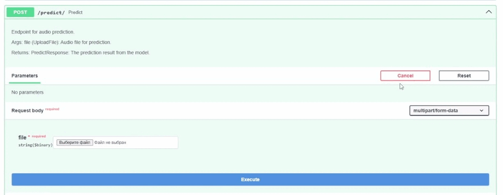
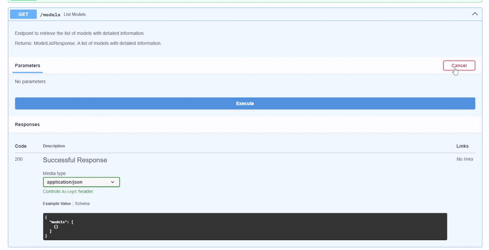
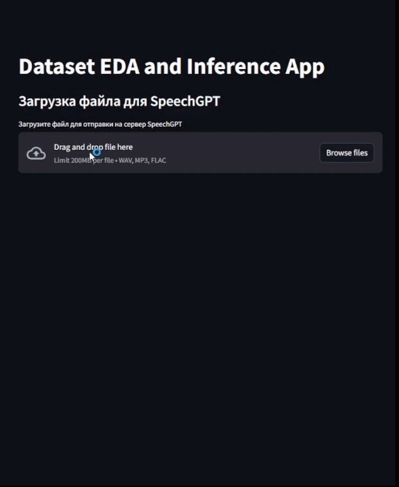
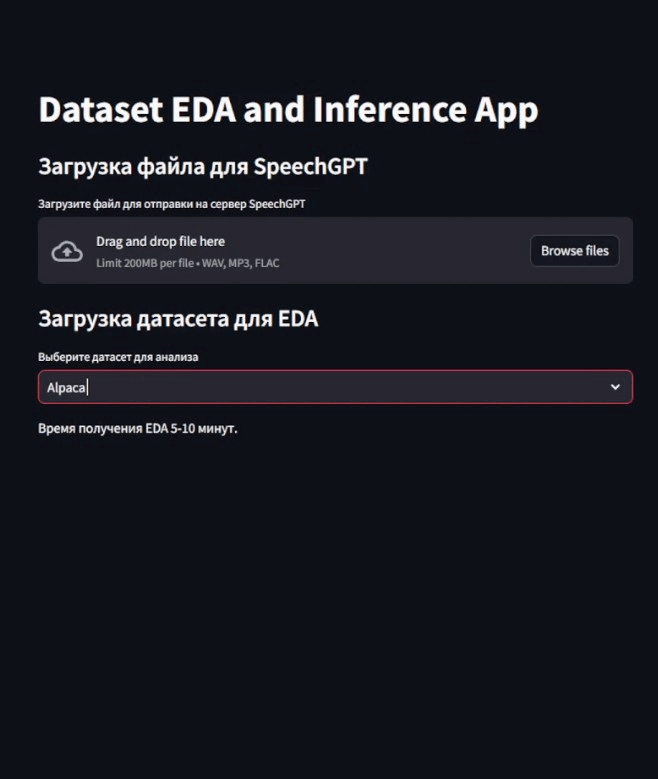

# SpeechGPT

В проекте планируется реализации мультимодально модели speech-to-text `SpeechGPT`. Особенности этой модели будут следующими:
1. Объединение ASR + GPT в одной модели
2. Sound Understanding and Reasoning

# Запуск 

Запуск выполняет из главной директории с помощью docker compose: 
```
# в главной папке (/SpeechGPT) последовательно выполнить

docker compose build
docker compose up
```

# Работа сервиса

## FastAPI

Здесь представлены основые юз-кейсы сервиса, полный список эндпоинтов можно найти в report.pdf

### Получение ответа на голосовой вопрос 



### Получение списка моделей




## Streamlit

### Получение ответа на голосовой вопрос 



### Получение EDA



### Куратор
- Ершов Иван (тг @tutugarin)

### Список участников
- Алмасян Санасар Багдасарович (@s_almasyan)
- Тюпляев Никита Алексеевич (@ntyuplyaev)
- Якунин Иван Вадимович (@pokemon_basmanny)
- Лотц Никита Константинович (@nikitalotts)
- Петров Олег Евгеньевич (@allwheelsdrive0)
