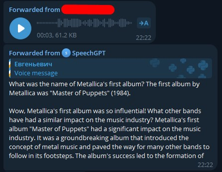

# Бейзлайн

В качестве бейзлайна для SpeechGPT был взят каскад моделей ASR (Whisper-turbo) + LLM (Qwen2): они были адаптированы под фреймворк Fairseq с целью дальнейшего обучения на нем, в этом же фреймворке была создана модель AsrLlmCascadeModel. На вход она принимает аудиофайлы (или токены), в качестве ответа возвращает текст.

Все три модели можно найти [здесь](./speechgpt/models/)

Для взаимодействия с моделю был создан и развернут телеграм-бот, пример работы можно видеть ниже.

